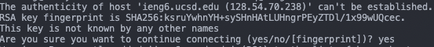
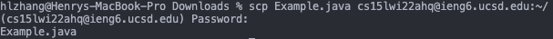

<h1 align = "center">
Week 2 Lab Report: Remote Access Tutorial
</h1>

## *Step 1: Installing Visual Studio Code*

The first step in remote access is installing Visual Studio Code, or VSCode for short. This can be done by searching "VSCode Download" then following the first [link](https://code.visualstudio.com/download). Next, choose the correct operating system, and download the corresponding file.

Once you have finished installing VSCode, run the program. It should appear like the image below:


## *Step 2: OpenSSH and Remotely Connecting*

The second step begins with(for Windows users only), installing OpenSSH by following the instructions in this [link](https://github.com/SkylerGoh/cse15l-lab-reports/blob/main/lab-report-1-week-2.md#part-1-visual-studio-code).

Once you have OpenSSH, open VSCode and open a new terminal. The keyboard shortcut for Windows is Ctrl + `, while the Mac version is with Command. Additionally, there is also an option in the "Terminal" drop-down called "New Terminal".

In the new terminal you have just created, type the following command: `ssh cs15lwi22___@ieng6.ucsd.edu`, with the `___` replaced with your own course-specific account. This can be found at this [link](https://sdacs.ucsd.edu/~icc/index.php).

After you have executed the command, if it is your first time connecting to the server, you will get a message similar to the following:



Type "yes" when the line `Are you sure you want to continue conncting (yes/no/[fingerprint])?` shows up. Afterwards, it should prompt you for your password with a line similar to `(cs15lwi22___@ieng6.ucsd.edu) Password:`. Enter the password for your course-specific account and the following should pop up:


You are now logged in remotely!

## *Step 3: Commands*

Try running a few of the following commands on the server:

* `cd ~`
* `cd`
* `ls -a`
* `mkdir`

An example of some commands, executed, is shown below:


After you are done testing commands, to log out of the remote server, simply use the keyboard shortcut Ctrl + D, or type `exit` in the command line and execute it.

## *Step 4: Remotely Moving Files with `scp`*

One of the key parts of working remotely using SSH is the ability to move and run files back and forth between the local computer and the remote server. 

The command that allows us to move files is `scp`. First create an example file named `Example.java`. Implement the following code into the file:

```
class Example {
    public static void main (String[] args) {
        System.out.println("This is an example file.");
        System.out.println("Hello " + System.getProperty("user.name") + ", nice to meet you!");
        System.out.println("You are in " + System.getProperty("user.home"));
    }
}
```

Test this file by running it locally on your computer, with the `javac Example.java` and `java Example` commands. Observe the output.

Next, we will run the following command locally: `scp Example.java cs15lwi22___@ieng6.ucsd.edu:~/`, where again, the `___` is replaced with the three letters in your course-specific account. You will then be prompted for your password again, and upon entering your password, you will see something similar to the following:



To make sure that the file is now also in the remote server, we use the command `ls`. Next, run the file on the remote server by again using the `javac Example.java` and `java Example` commands. Notice how the output is different. What might be the cause of this?

## *Step 5: Improving Workflow with SSH Keys*

When working between a local computer and a remote server, we want to improve our efficiency in our workflow. But how might we do this? One way is using SSH keys. SSH keys make our lives a lot easier by letting us skip over our password. We begin the process of setting one by typing `ssh-keygen`. Something similar to the following should appear: 


Next, we will copy the public key to the .ssh directory on the remote server. We do this by first sshing, then using `mkdir .ssh` to make a new directory naked ".ssh". Then go back to your local client and execute the command: `scp /Users/***/.ssh/id_rsa.pub cs15lwi22___@ieng6.ucsd.edu:~/.ssh/authorized_keys` where `***` is replaced with your username on your client and `___` is replaced with your course-specific account letters. Now, you will be able to `ssh` into the remote server without typing in your password every time.

## *Step 6: Optimization of Remote Running*

To optimize running on the remote server, we can use these 3 useful tips:

1. Directly running commands on the remote server as you ssh into the remote server in one command is in the following format: `ssh cs15lwi22___@ieng6.ucsd.edu "command"`, where command can be any command you choose to run on the remote server. Below is an example of compiling and running Example.java on the remote server while sshing:


2. Use the up/down arrow keys to find commands that you have previously executed.

3. You can run multiple commands at once in the command line, whether it be on your local client or the remote server by putting semicolons between each command: `command ; command`
