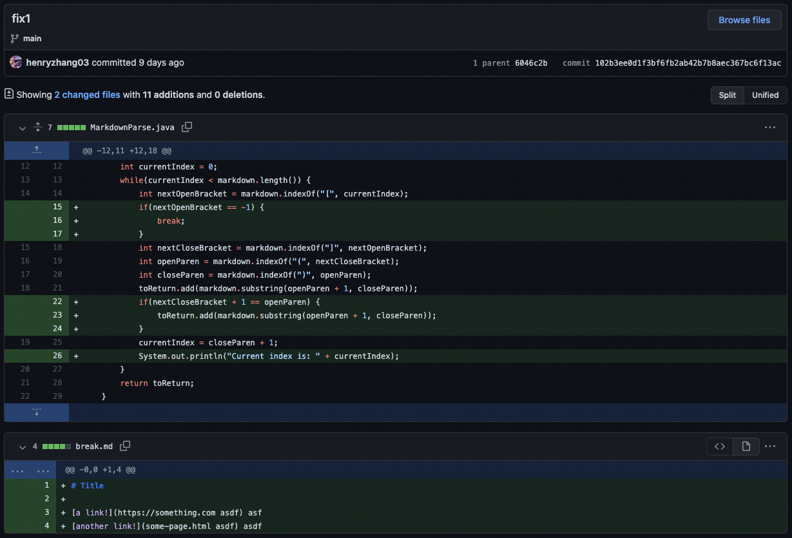
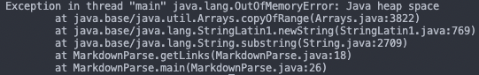
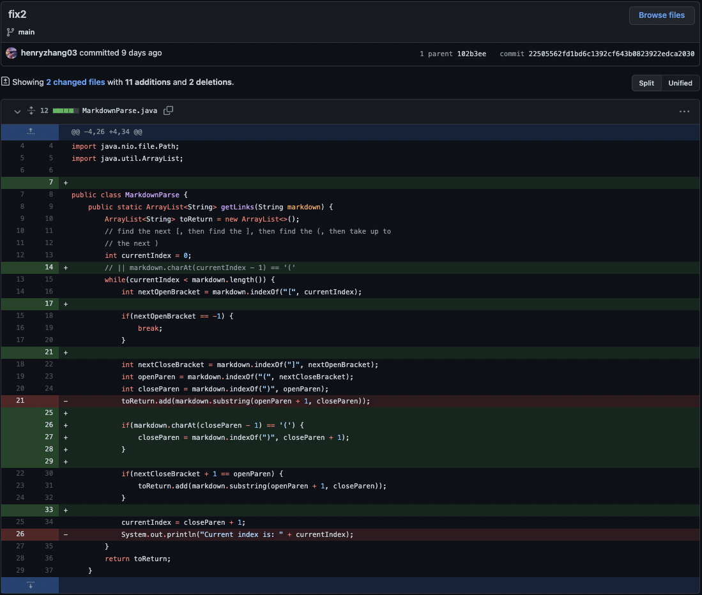
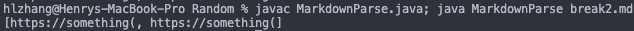
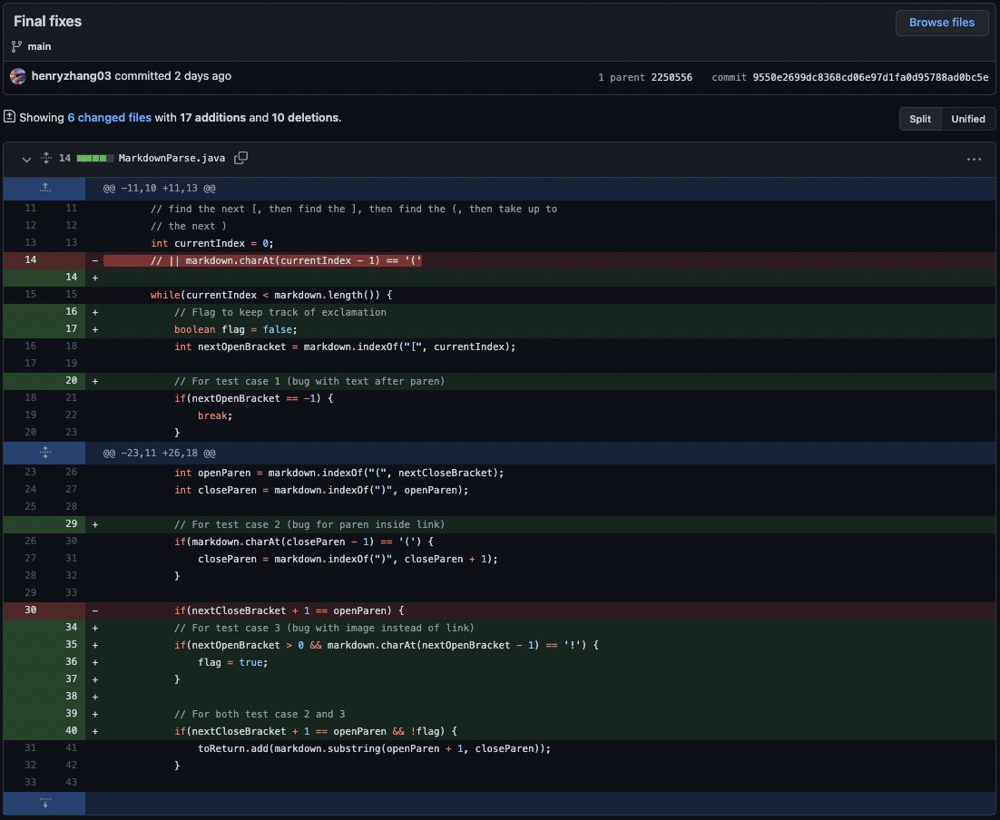
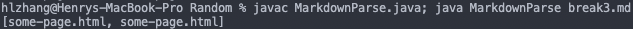

<h1 align = "center">
Week 4 Lab Report: Fixing Bugs
</h1>

## *Bug 1: Text After Last Link*

The file for the failure-inducing input that prompted me to make the change is [here](https://github.com/henryzhang03/markdown-parse/blob/main/break1.md).

I ran the command `javac MarkdownParse.java; java MarkdownParse break1.md`.

The output of the command from above for this particular bug is shown below:

The symptom of the bug is that it took a while for the command to run through, but then it gave an `OutOfMemoryError: Java heap space`. The bug occurs because the variable `currentIndex` would not reach the end of MarkdownParse, so it would keep searching for links without there being any to be found. This is because the last assignment of currentIndex would continue the while loop, as `markdown.indexOf(")", openParen) + 1` (the value of currentIndex at the end of the whole loop) would never be larger than or equal to `markdown.length`. This causes an infinite loop to happen, and since `toReturn` was being added to each time the loop ran, it causes an OutOfMemoryError symptom. The `break1.md` file/input caused this symptom because any character after the last link would prevent `currentIndex` to be assigned a value equal to `markdown.length`.

## *Bug 2: Parentheses Within URLs*

The file for the failure-inducing input that prompted me to make the change is [here](https://github.com/henryzhang03/markdown-parse/blob/main/break2.md).

I ran the command `javac MarkdownParse.java; java MarkdownParse break2.md`.

The output of the command from above for this particular bug is shown below:

The symptom of the bug is that it printed the desired URL twice, each time with only the part of the URL before the first close parenthesis. The bug occurs because MarkdownParse finds the first occurance of a close parenethesis after the first open parenethesis. It then returns everything in between those 2 parentheses, instead of trying to search for another close parenthesis to have 2 pairs. This causes the program to print out everything between the first open parenethesis and the first close parenethesis. The `break2.md` file/input caused this symptom because because it had a pair of parenetheses withint the URL.

## *Bug 3: Images vs Links*

The file for the failure-inducing input that prompted me to make the change is [here](https://github.com/henryzhang03/markdown-parse/blob/main/break3.md).

I ran the command `javac MarkdownParse.java; java MarkdownParse break3.md`.

The output of the command from above for this particular bug is shown below:

The symptom of the bug is that it mistook an image's URL to be a link and prints it anyways. The bug occurs because MarkdownParse doesn't differentiate between images and links in markdown. This is because there is no checker for exclamation points. The program ignores the exclamation point and proceeds normally, finding the link that is actually an image's link. The `break3.md` file/input caused this symptom because because it had an exclamation point before the first open bracket, making it an image in markdown.