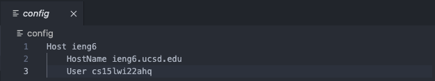
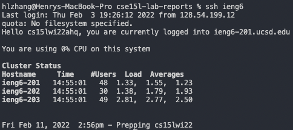
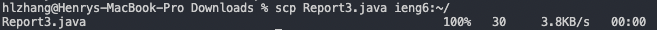

<h1 align = "center">
Week 6 Lab Report: Streamlining ssh Configuration
</h1>

## *Part 1: Config File*

I edited my `~/.ssh/config` file using VSCode by opening the `.ssh` folder in VSCode and creating a `config` file with no extension. The content I put into it is shown above.

## *Part 2: SSHing with Alias*

Above is a screenshot of me logging into my remote account using only the alias I chose in my config file with `ssh ieng6`, where `ieng6` is the alias I chose.

## *Part 3: SCPing with Alias*

Above is a screenshot of me scping a `.java` file using my alias by typing in the command `scp Report3.java ieng6:~/`.